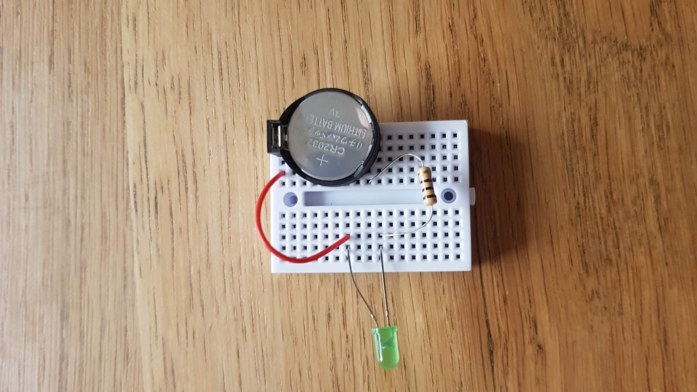
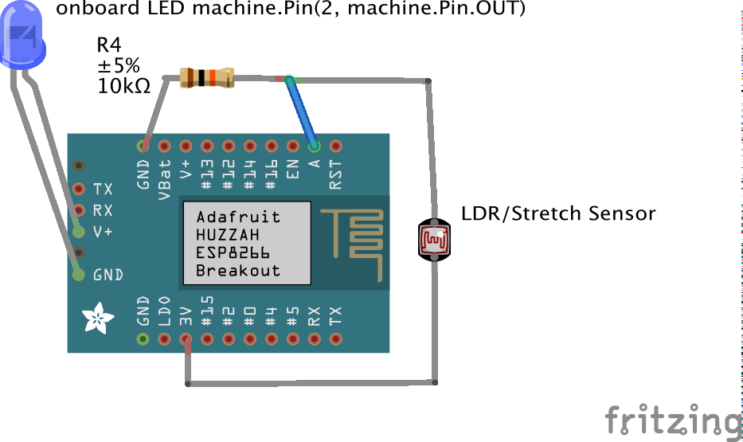

## Wearable Technology Badge Workshop


Make a small interactive rechargeable wearable badge over 4 weeks to get you started in the world of wearable technology. Designed to give you an understanding of basic fundamentals in electronics, embroidery and coding in the versatile progamming language micropython to control interactive intimate wearables.  We'll use DIY conductive yarn pressure sensors and variants of low cost ESP8266 development boards that can help you deploy all kinds of wearable (and non-wearable) technology.

With this experience you'll be able to prototype and deply wearable tech for art, performance, fashion, product development. It's a chance to share your ideas with peers and meet other members of the DoES Liverpool community and get to know our facilities for the future.

All materials are provided, with extensive workshop notes, reference and resources here plus your own kit featuring an ESP8266 development board, Sublimation printed sensor, single and 6-ring NeoPixels, and a rechargeable battery pack you can for your next project.

Under 16s must be accompanied by a parent or guardian, suitable for ages 12 and up.

### Structure

 1. [Analog Textile Sensor making](#session-1)
 1. [LED & NeoPixel control with ESP8266 and MicroPython](#session-2)
 1. [Analog Sensor & ESP8266](#session-3)
 1. [Advanced ESP8266, sensor & LED control & Wearable Badge constructing](#session-4)

### Session 1

Make & test an analog textile sensor to understand the basics of electrical resistance and the flow of current in a simple circuit.


Our breadboard lets us easily connect electronic components and wire of the correct gauge clearly without the components falling out. They are how people prototype a circuit, and quite often you will rewire it in a way that's more robust and permanent or even design and make your own printed circuit boards (PCBs). On these mini 170-point breadboards there are 2 columns of 17 rows of 5 pins. Each 5 pin set on a  row are connected electrically so current flows through components. We generally dont use voltage over 12V when using these breadboards so we never have anything close to mains voltage. We are not even going above 3.7V with our wearables!

Follow the pictures below to make the circuit and compare it with the circuit diagrams provided. That's how you'll find diagrams on the internet and in electronics books, so it's worth having a look at those and doing some further research.

#### Circuit


Insert your LED. It matters which way the LED goes in; it's got a negative cathode `-` and a positive anode `+` if you get it wrong you can damage it. The long leg of the LED is `+'ve`, the shorter leg, the cathode, is `-'ve'`


Add your coin cell holder and coin cell. Be careful you understand the `+'ve` and `-'ve` cathod and anode. The `+` on the coin cell should be visible facing up, the Flat side of the coin cell holder is `-`


Add a red jummper wire connecting the long leg `+` anode of the LED with the `+` anode of the coin cell holder, the pin nearest the flat side of the holder





#### Component List

Component|No.|Source|Produced|Notes
--|--|--|--|--
170 point<br>mini breadboard|1|DoES|China|For prototyping
3V CR2032 coin cell battery|1|Ebay|
Two Pin Button|1|[Taydae Electronics](https://www.taydaelectronics.com/tact-switch-6-6mm-5mm-through-hole-spst-no.html)|China|simple breadboard compatible button
CR2032-compatible Watch Battery holder|1|[BatteryHolders.com](http://batteryholders.com/part.php?pn=BC2032-E2&original=CR2032&override=CR2032)|China|Easy breadboarding holder
Red Stripped solid core 22AWG wire|1|[Farnell](https://uk.farnell.com/c/cable-wire-cable-assemblies/hook-up-wire?wire-gauge=22awg)|[Alphawire](http://www.alphawire.com/) New Jersey US|Stripped fits into breadboards easily
Green Stripped solid core 22AWG wire|1|[Farnell](https://uk.farnell.com/c/cable-wire-cable-assemblies/hook-up-wire?wire-gauge=22awg)|[Alphawire](http://www.alphawire.com/) New Jersey US|Stripped fits into breadboards easily
Resistor 100 Ohm|1|Ebay|China|Resistor; fits anyway round (polarity doesn't matter)
Resistor 10K Ohm|1|Ebay|China|Resistor; fits anyway round (polarity doesn't matter)

This first step develops the basics of a pressure sensor; we can refer to more complex and accurate sensors and reflect on their usage.

### Further Reading

You can read about an alternative form of pressure sensor using [Velostat](https://www.adafruit.com/product/1361) that Laura made for another workshop using a similar microcontroller [Microbit](https://www.microbit.org/) belwo, that also runs micropython the programming language we are using to control our sensors and LED's.

[Pressure sensor build](https://github.com/DoESLiverpool/what-does-health-look-like/tree/master/pressure-sensor)

### Session 2


Flash LEDs in response to our sensors using micropython on ESP8266



#### Micropython and the ESP8266


We're using the a few variant breakout boards of the ESP8266 like the WeMos D1 Mini Development Board in the diagram above or the bigger [ESP-12E-CP2102](https://www.ebay.co.uk/itm/Esp8266-Esp-12E-Cp2102-Wifi-Network-Development-Board-Module-For-Node-Mcu-GD/264530529453) variant which you can see above with its `GPIO` pin arrangement. We'll be using these in our workshops and you'll be able to take them home.

You can refer to the [MicroPython tutorial for ESP8266](https://docs.micropython.org/en/latest/esp8266/tutorial/index.html#micropython-tutorial-for-esp8266) for full details, but we've selected.

#### Connecting up

You'll need `CP2102` USB Module drivers to work with our ESP8266's which you can get from our friends at [Shrimping.It](https://shrimping.it/drivers/) and we'll provide them in the workshop from [here](drivers)

Linux distributions include built-in CP2102 drivers, although Linux user accounts may need membership of the 'dialout' or 'serial' permission groups to access the device.

#### Using PUTTY

To get connected on Windows you might be best using PUTTY

Windows Download [PuTTY](https://putty.org/) to connect your ESP8266 to your computer over USB-Serial and be able to send commands to control and set it up.

Linux - Use the built in `screen`, `minicom` or Putty using `$ sudo apt-get install putty` in your Linux Terminal. I'd recommend screen.

Mac - Download [PuTTY](https://putty.org/) or use the built-in `Applications/Terminal` and `screen`

#### Using `screen`

On macos and Linux you can just use a Terminal and `screen`. If your linux doesnt have screen install with `sudo apt-get install screen` or `brew install screen` on a mac after setting up [HomeBrew](https://brew.sh/)

`$ ls /dev/tty*`

to list your usb devices.

`$ screen /dev/device_name baud-rate`
is the general format.

`$ screen -S wearable /dev/tty.SLAB_USBtoUART 115200`

Then press enter and you'll see the python prompt. You are now connected to your ESP8266!


### Micropython Command Walkthrough

In python like we saw earlier, we import the tools we need to do the various things we need, with microbit, most of it is already there.

Get the machine module to control our ins and outs

`import machine`

Lets define a Pin as an output, using the onboard Pin no. 2

`ledPin2 = machine.Pin(2, machine.Pin.OUT)`

This should turn the LED on!

Now try:

`ledPin2.off()`

Annoyingly defining the pin like this means off has no effect, but we can use Signal to abstract away this.

`from machine import Signal`
`Led2 = Signal(ledPin2, invert=True)`

now things will work more intuitively if we use Led2 instead!

`Led2.off()`
`Led2.on()`

Ok now lets read one of our sensors. Wire up following the diagram above.

The ADC (analog to digital conversion) Pin is labelled A0 on your board and we will need the ADC class to make it work

`from machine import ADC`
`adc = ADC(0)`
`adc.read()`

Will return a value. Ok lets get it to read the values until we press `ctrl +c`. We will use a simple loop using `while`

`while True:` press return and you will see `...` and your cursor will indent automatically.

`adc.read()`

Now press return, and you get another indent, return a few time indicates thats the end of that loop and it will then execute the code.

Play with your sensor and watch the numbers change. Cool eh? Bit fast though, lets slow it down with `time`

`import time`

Now we can use `time.sleep(seconds)` to wait before reading the pin again.

```
while True:
    adc.read()
    time.sleep(0.5)
```

Now lets use that to blink our LED

```
while True:
    Led2.on()
    time.sleep_ms(adc.read() * 10)
    Led2.off()
    time.sleep_ms(adc.read() * 10)
```

Ok but higher resistance, bigger stretch or pressue is slowing our flashes. WE can flip it round

```
while True:
    stretch = 500 - (adc.read() *10)
    Led2.on()
    time.sleep_ms(stretch)
    Led2.off()
    time.sleep_ms(stretch)
```

### Making Permanent Changes

You need to make a `main.py` file on the board. To do this you need to write your code and copy it into the command line prompt of the ESP

So copy the text from [main.py](main.py).
Then in your open console for your ESP:

`f = open('main.py', 'w')`

then use **paste mode**: move your cursor to just after the set of 3 quotes (they are essential) and press `ctrl + e` and you will be given a few options: right click paste or shortcut `cmd + v` to paste in your text for the programme. Then finish and call `f.close()` to close and save the file.

```
f.write('''paste_your_text here''')
f.close()
```

Check its there with

`import os`
and
`os.listdir()` to check it's there.


Now reboot, and if your file is correct it will run the `boot.py` script (don't worry about that for now it just sets up the board and python) and then your `main.py` file should run!

We generally prototype code by running it line by line, a bit like having a *conversation* with your board. I like the way that weirdly makes you feel more connected to it and we think it might help you learn.

Then you can write your `main.py` file based on these conversations, have a look at our [`main.py` template](main.py) to see how our 'conversations' we've had here looks as a complete python script. (it is like writing the script of the conversation you've alread had :smile:

### Ampy

There are other methods to upload more complex files you can look at like [ampy](https://github.com/scientifichackers/ampy) so we will try setting this up for you.

 * `ampy --port /dev/MY_PORT_NAME ls` Lists files

 * `ampy --port /dev/MY_PORT_NAME put examples/circle/lights.py` Puts the file on the board

 * `ampy --port /dev/MY_PORT_NAME rm examples/circle/lights.py` Removes the file on the board

### PWM output and Controlling LEDs

We've taken from [this tutorial by Random Nerd Tutorials](https://randomnerdtutorials.com/esp32-esp8266-pwm-micropython/)


For this example, wire an LED to your ESP board. We’ll wire the LED to `GPIO 5` (marked as `D1` on your board), but you can choose another suitable PWM pin

Here’s the script that changes the LED brightness over time by increasing the duty cycle.

```
from machine import Pin, PWM
from time import sleep

frequency = 5000
led = PWM(Pin(5), frequency)

while True:
    for duty_cycle in range(0, 1024):
    led.duty(duty_cycle)
    sleep(0.005)
```

Also refer to these tutorials
 * [PWM Tutorial](https://docs.micropython.org/en/latest/esp8266/tutorial/pwm.html#pulse-width-modulation)
 * [Fading an LED](https://docs.micropython.org/en/latest/esp8266/tutorial/pwm.html#fading-an-led)

### NeoPixels

To wire up you just connect `3.3V`(marked as `3V3` on your board) to `+VCC` on the neopixel, `GND` (marked `GND` on your board) to `GND` on the neopixel, and `GPIO5` (marked as `D1` on your board to the `IN` or `DIN` on the neopixel. NeoPixels have got all the resistors on board so you wont need to protect your Digital pins when using them.


NeoPixels are addressable RGB LEDs and micropython has a library module just for that! Add the [`lights.py`](https://github.com/cheapjack/WearableTechBadge/blob/master/examples/circle/lights.py) script to your board and with a quick

```
from lights import *
```

You can run this example code from the [NeoPixel MicroPython Guide](https://docs.micropython.org/en/latest/esp8266/tutorial/neopixel.html):

Once the `lights.py` file is on board, re-log on to your board and you can run these commands:

`cycle()`, `bounce()`, `fade()` and `clear()`

There's also a [`main.py`](https://github.com/cheapjack/WearableTechBadge/blob/master/examples/circle/main.py) you can add so they run on booting the board.

Try writing your own combinations of these functions on a loop and try changing the for loops to cycle through colours


```
from machine import Pin
from neopixel import NeoPixel
import time

n = 7 # Set the number of pixels on your NeoPixel
pin = Pin(5, Pin.OUT)   # set GPIO5 (D1) to output to drive NeoPixels
np = NeoPixel(pin, 7)   # create NeoPixel driver on GPIO0 for 7 pixels
np[0] = (255, 255, 255) # set the first pixel to white
np.write()              # write data to all pixels
np[0] = (0, 0, 0) # set the first pixel to nothing (black)
np.write()              # write data to all pixels

def cycle():
    for i in range(4 * n):
        for j in range(n):
            np[j] = (0, 0, 0)
        np[i % n] = (255, 255, 255)
        np.write()
        time.sleep_ms(25)

def bounce():
    for i in range(4 * n):
        for j in range(n):
            np[j] = (0, 0, 128)
        if (i // n) % 2 == 0:
            np[i % n] = (0, 0, 0)
        else:
            np[n - 1 - (i % n)] = (0, 0, 0)
        np.write()
        time.sleep_ms(60)

def fade():
    for i in range(0, 4 * 256, 8):
        for j in range(n):
            if (i // 256) % 2 == 0:
                val = i & 0xff
            else:
                val = 255 - (i & 0xff)
            np[j] = (val, 0, 0)
        np.write()

def clear():
    for i in range(n):
        np[i] = (0, 0, 0)
    np.write()
```


#### Components

Component|No.|Source|Cost|Notes
--|--|--|--|--
Microusb data cable|1|Ebay|£1.20|
NodeMcu-CP2102-ESP8266 Development Board (narrow profile)|1|[AliExpress](https://www.aliexpress.com/item/32665100123.htm)|£1.93|
Jumper Wires|10|Ebay|£1|
Resistor 4.7k Ohm|1|Ebay|£0.50|
Conductive Yarn|1|Various|£1|
Pressure Sensor|1|Various|£1|
Conductive Rubber|1|Various|£1|
Textile Back|1|Various|£1|
TOTAL|||£8.63|

### Session 3


Re-visit our sensor circuit but this time combine with our ESP8266 boards and controlling our LEDs

### Session 4


Fabricate our amoeba shaped wearable badge and assemble everything using a textile pocket to enclose electronics

 * Enclose the ESP circuit in a customisable fabric template

## TODO

 * [x] Re-solder the press studs
