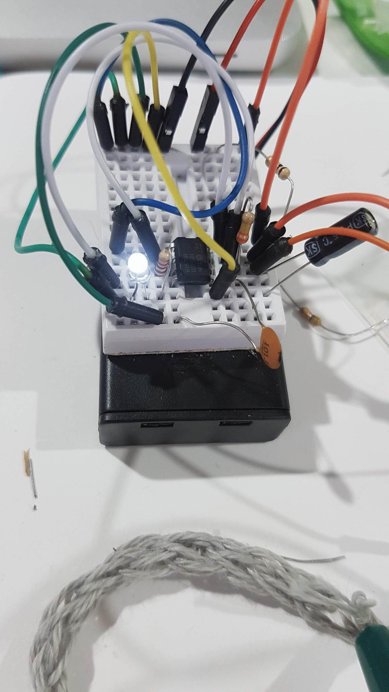
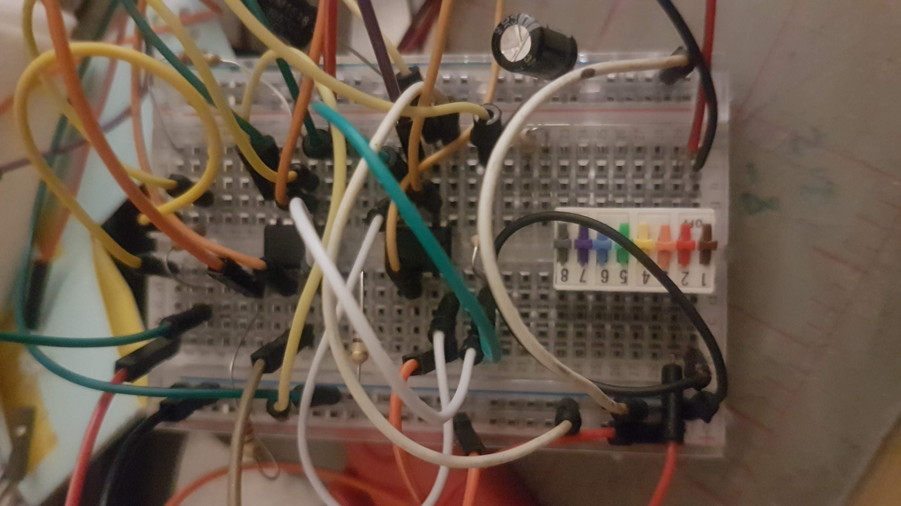

## Wearable Tech Badge Workshop

Learn basics of wearable technology with microbits, sensors, Processing, simple electronics 

### Simple Flasher

Component|No.|Source|Produced|Notes
--|--|--|--|--
Mini Breadboard|1|ShrimpingIt surplus|China
3V Battery pack|1|ShrimpingIt surplus|China|Considering replacing with rechargeable LIPO battery
Jumper Wires|9|DoES Surplus|
555 Timer Chip|1|Ebay|China
Capacitor 1μF|1|ShrimpingIt surplus|China
Resistor 1k Ohm|2|ShrimpingIt surplus|China
Resistor 470k Ohm|1|ShrimpingIt surplus|China
Conductive Yarn |||

### Traffic light

Component|No.|Cost|Source|Produced|Notes|SubTotal
--|--|--|--|--|--|--
Mini Breadboard|5|1.196|[Ebay](https://www.ebay.co.uk/itm/5pcs-5x-WHITE-Mini-170-Tie-Point-Solderless-Breadboard-Prototype-Arduino-PIC-PI/262900293129)|China||£5.98
555 Timer Chip|10|0.185|[Ebay](https://www.ebay.co.uk/itm/10-x-NE555P-Timer-DIP-8-IC-Timer-Fast-Delivery-UK-Seller/323925336619)|China||£1.85
9V Battery pack|1||ShrimpingIt surplus|China|Considering replacing with rechargeable LIPO battery
Jumper Wires|40||ShrimpingIt Surplus|
Capacitor 100μF|1||ShrimpingIt surplus|China
Resistor 47K Ohm|1||ShrimpingIt surplus|China
Resistor 470 Ohm|1||ShrimpingIt surplus|China
Resistor 220 Ohm|2||ShrimpingIt surplus|China
Resistor 100k Ohm|1||ShrimpingIt surplus|China

### Previous Builds

Remade the flasher circuit using the [555 Timer circuits schematic](http://www.555-timer-circuits.com/flashing-led.html) but with a space for variable resistors
