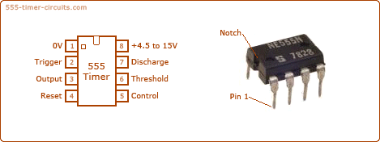
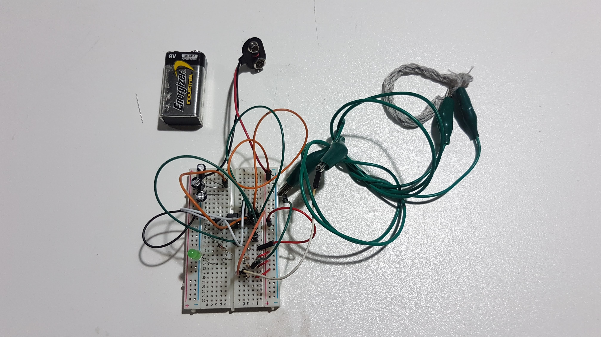
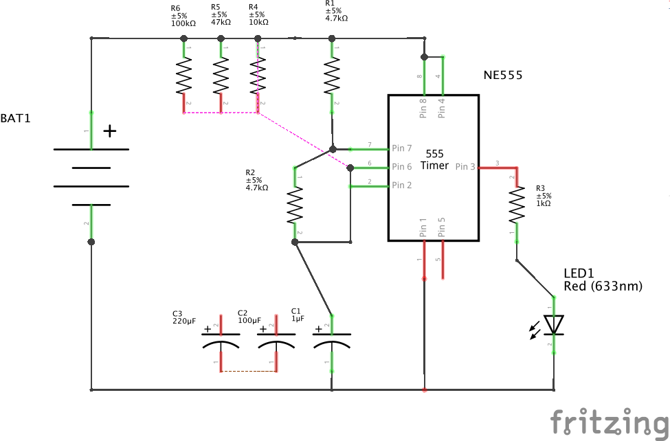
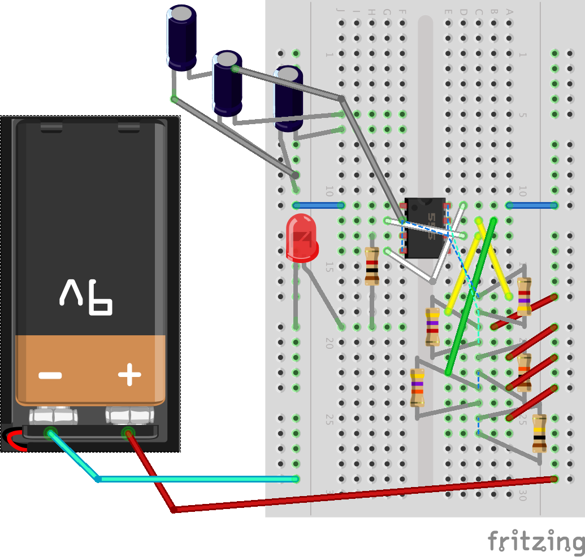

## Wearable Technology Badge Workshop

Make a small interactive rechargeable wearable badge over 4 weeks to get you started in the world of wearable technology. Designed to give you an understanding of basic fundamentals in electronics, embroidery and coding in the versatile progamming language micropython to control interactive intimate wearables.  We'll use DIY velostat and conductive yarn sensors, analog timer chips and variants of low cost ESP8266 development boards that can help you deploy all kinds of wearable (and non-wearable) technology.

With this experience you'll be able to prototype wearble tech for art, performance, fashion, product development. It's a chance to share your ideas with peers and meet other members of the DoES Liverpool community.

All materials are provided, with extensive workshop notes and reference and resources plus your own ESP8266 development board and battery pack you can re-use for prototyping your next project.

Under 16s must be accompanied by a parent or guardian, suitable for ages 12 and up.


### Structure

 1. Sensor making & Wearable prototyping with Microbit and Micropython
 1. LED flashing with timer chips
 1. LED flashing with ESP8266 and MicroPython
 1. Wearable constructing

### Session 1

<!---->

Make & test a DIY Wearable Pressure Sensor using a [Microbit and Micropython](https://microbit.org/guide/python/)


This first step develops the basics of a pressure sensor; we can refer to more complex and accurate sensors and reflect on their usage.

 * Follow the [WDHLL pressure sensor build](https://github.com/DoESLiverpool/what-does-health-look-like/tree/master/pressure-sensor)
 * Decide on where and how to wear it and connect it the badge

### Session 2a

Connect Microbit and sensor to P5.js and experiment with code
> I've some reservations about this bit now. Mainly it's jumping across two programming languages which doesn't make much sense in one workshop that might put people off or confuse them. It made sense for WDHLL but we stuck to blocks and JavaScript with microbit. Really the data visualisation should be expressed in the wearable materials, LEDs, motors etc. So I think replacing this with the timer workshop might be a good idea. But just do the simple flasher as an experience for people. Have a look at the [Stucture above](#structure)


Here we use [Microbit](https://microbit.org/code/) and [p5.js](https://p5js.org/) to learn basic principles of how to manipulate analog sensor data with code and share on platforms like [OpenProcessing](https://openprocessing.org) and [Glitch](https://glitch.com)

 * We will borrow the course materials from the [What DoES Health Look Like (WDHLL)](https://github.com/DoESLiverpool/what-does-health-look-like/) workshop made by [@Laura_pullig](https://twitter.com/Laura_pullig) & [@Zarino](https://twitter.com/zarino) to learn and experience coding for data visualisation.
 * We'll start with an introduction to Microbits as it's a good way in to code for newcomers.
 * We'll introduce peope to P5.js, a javascript implementation of the popular Processing programming language.
  * Use [jackie1050's & zarinos test openprocessing sketches](https://www.openprocessing.org/user/139031) and experiment with P5.js.

<!--
-->

### Session 2b

Make a circuit that illuminates LEDs in flashing sequences

> I think we might lose this in favour of an extra prototyping session but can keep here for reference elsewhere [Stucture](#structure)


Here the 3 of us were interested in exploring physical computing in counterpoint to the previous workshops software layers. We are often frustrated with having to use code to do simple routing or logic that could be done with electronic components. Programming with components means you really understand what components do and how they scale up into Integrated circuits and gives a more intimate understanding of the tech we use.


 * We've used this [555 Timer Learning Site](http://www.555-timer-circuits.com/) to make our circuits


#### 555 Timers

We are using the simple `555` timer chip, one of the most common workhorses of electronics. This integrated circuit creates oscillating square wave signals that can be used to control the flow of voltage in a circuit and so control the logic of say, controlling an LED.



Find out more on this [555 Timer Circuit website](http://www.555-timer-circuits.com/#circuits)


#### Simple Flasher





We've made a circuit with an array of capacitors and resistors so you can experiment with the timings

##### Timing LED pulses

 * C1 1µF Capacitor
 * C2 100µF Capacitor
 * C3 220µF Capacitor
 * R1 = 4.7K Ohm
 * R2 = 4.7K Ohm
 * R3 = 1K Ohm
 * R4 = 10K Ohm
 * R5 = 47K Ohm
 * R6 = 100K Ohm

You can work out the timings with this formula

t<sub>on</sub> = 0.69 x C1 x (R1 + R2)
t<sub>off</sub> = 0.69 x C1 x R2

t<sub>on</sub> = Length of high pulse (seconds)
t<sub>off</sub> = Length of low pulse (seconds)
C1 = Capacitance in Farads
R1 = Resistance in Ohms
R2 = Resistance in Ohms

#### Example

t<sub>on</sub>  = 0.69 x 0.0001 x (4700 + 4700) = 0.64 seconds
t on = 0.69 X 0.000220 x (4700 + 4700) = 1.42 seconds

#### Components

Component|No.|Source|Produced|Notes
--|--|--|--|--
300 point Half Breadboard|1|ShrimpingIt surplus|China
9V Battery pack|1|ShrimpingIt surplus|China|Consider replacing with rechargeable LIPO battery
Jumper Wires|9|DoES Surplus|
555 Timer Chip|1|Ebay|China
Capacitor 1μF|1|ShrimpingIt surplus|China
Capacitor 100μF|1|ShrimpingIt surplus|China
Capacitor 220μF|1|ShrimpingIt surplus|China
Resistor 4.7k Ohm|1|ShrimpingIt surplus|China
Resistor 4.7k Ohm|1|ShrimpingIt surplus|China
Resistor 10k Ohm|1|ShrimpingIt surplus|China
Resistor 47k Ohm|1|ShrimpingIt surplus|China
Resistor 100k Ohm|1|ShrimpingIt surplus|China
Conductive Yarn/Rubber/Pressure Sensor|||

### Session 3


Flash LEDs in response to our sensors using micropython on ESP8266 


#### Micropython and the ESP8266


We're using the a few variant breakout boards of the ESP8266 like the WeMos D1 Mini Development Board in the diagram above or the bigger [ESP-12E-CP2102](https://www.ebay.co.uk/itm/Esp8266-Esp-12E-Cp2102-Wifi-Network-Development-Board-Module-For-Node-Mcu-GD/264530529453) variant which you can see above with its `GPIO` pin arrangement. We'll be using these in our workshops and you'll be able to take them home.

You can refer to the [MicroPython tutorial for ESP8266](https://docs.micropython.org/en/latest/esp8266/tutorial/index.html#micropython-tutorial-for-esp8266) for full details, but we've selected.

#### Connecting up

Windows - Install [Drivers](https://wiki.wemos.cc/downloads) *(possibly not necessary)* Download [PuTTY](https://putty.org/) to connect your ESP8266 to your computer on USB-Serial
Linux - Use the built in `screen` or Putty using `$ sudo apt-get install putty` in your Linux Terminal
Mac - Install [Drivers](https://wiki.wemos.cc/downloads). Then download [PuTTY](https://putty.org/) or use the built-in `Applications/Terminal` and `screen`

##### Using `screen`

In terminal you can use the command

`$ ls /dev/tty.*`
to list your usb devices.

`$ screen /dev/device_name baud-rate`
is the general format.

`$ screen -S wearable /dev/tty.SLAB_USBtoUART 115200`

Then press enter and you'll see the python prompt. You are now connected to your ESP8266!

### Micropython Command Walkthrough

In python like we saw earlier, we import the tools we need to do the various things we need, with microbit, most of it is already there.

Get the machine module to control our ins and outs

`import machine`

Lets define a Pin as an output, using the onboard Pin no. 2

`ledPin2 = machine.Pin(2, machine.Pin.OUT)`

This should turn the LED on!

Now try:

`ledPin2.off()`

Annoyingly defining the pin like this means off has no effect, but we can use Signal to abstract away this.

`from machine import Signal`
`Led2 = Signal(ledPin2, invert=True)`

now things will work more intuitively if we use Led2 instead!

`Led2.off()`
`Led2.on()`

Ok now lets read one of our sensors. Wire up following the diagram above.

The ADC (analog to digital conversion) Pin is labelled A0 on your board and we will need the ADC class to make it work

`from machine import ADC`
`adc = ADC(0)`
`adc.read()`

Will return a value. Ok lets get it to read the values until we press `ctrl +c`. We will use a simple loop using `while`

`while True:` press return and you will see `...` and your cursor will indent automatically.

`adc.read()`

Now press return, and you get another indent, return a few time indicates thats the end of that loop and it will then execute the code.

Play with your sensor and watch the numbers change. Cool eh? Bit fast though, lets slow it down with `time`

`import time`

Now we can use `time.sleep(seconds)` to wait before reading the pin again.

```
while True:
    adc.read()
    time.sleep(0.5)
```

Now lets use that to blink our LED

```
while True:
    Led2.on()
    time.sleep_ms(adc.read() * 10)
    Led2.off()
    time.sleep_ms(adc.read() * 10)
```

Ok but higher resistance, bigger stretch or pressue is slowing our flashes. WE can flip it round

```
while True:
    stretch = 500 - (adc.read() *10)
    Led2.on()
    time.sleep_ms(stretch)
    Led2.off()
    time.sleep_ms(stretch)
```

#### Making Permanent Changes

You need to make a `main.py` file on the board. To do this you need to write your code and copy it into the command line prompt of the ESP

So copy the text from [main.py](main.py).
Then in your open console for your ESP:

`f = open('main.py', 'w')`

then use **paste mode**: move your cursor to just after the set of 3 quotes (they are essential) and press `ctrl + e` and you will be given a few options: right click paste or shortcut `cmd + v` to paste in your text for the programme. Then finish and call `f.close()` to close and save the file.

```
f.write('''paste_your_text here''')
f.close()
```

Check its there with

`import os`
and
`os.listDir()` to check it's there.

There are other methods to upload more complex files you can look at in the future like [ampy](https://github.com/scientifichackers/ampy)

Now reboot, and if your file is correct it will run the `boot.py` script (don't worry about that for now it just sets up the board and python) and then your `main.py` file should run!

We generally prototype code by running it line by line, a bit like having a *conversation* with your board. I like the way that weirdly makes you feel more connected to it and we think it might help you learn.

Then you can write your `main.py` file based on these conversations, have a look at our [`main.py` template](main.py) to see how our 'conversations' we've had here looks as a complete python script. (it is like writing the script of the conversation you've alread had :smile:


#### PWM output and Controlling LEDs

 * [PWM Tutorial](https://docs.micropython.org/en/latest/esp8266/tutorial/pwm.html#pulse-width-modulation)
 * [Fading an LED](https://docs.micropython.org/en/latest/esp8266/tutorial/pwm.html#fading-an-led)

#### Components

Component|No.|Source|Produced|Notes
--|--|--|--|--
Microusb data cable|1|||
Jumper Wires|4||
Resistor 4.7k Ohm|1||China
Conductive Yarn/Rubber/Pressure Sensor|||

### Session 4

Prototype our wearable. Build on our first prototyping session in Session 1.

Pull together what we learned with LEDs and presssure sensors, then show more

 * **Sensors:** buzzers, piezos, light sensors, accelerometers
 * **Actuators:** buzzers, piezos, motors, pumps, muscles

And if there's time, communication between wearables.

### Session 4
Fabricate our wearable


Finally we assemble everything using a textile pocket to enclose electronics

 * Enclose the ESP circuit in a customisable fabric template
