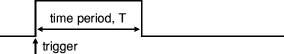
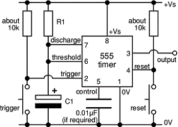
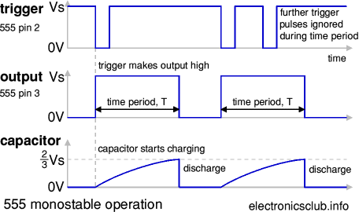
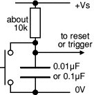
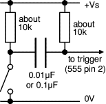

[{.logo width="125"
height="62"}](https://electronicsclub.info/)

555 Monostable
==============

::: {.clearboth}
:::

[Time period](#timeperiod) \| [Operation](#operation) \|
[Power on reset/trigger](#poweron) \| [Edge trigger](#edgetrigger)

[{.narrow width="74"
height="62"}](https://www.rapidonline.com/texas-instruments-ne555p-bipolar-single-timer-82-0336)

The [555 timer](555timer.htm) IC can be used with a few simple
components to build a monostable circuit which produces a single output
pulse when triggered. It is called a *mono*stable because it is stable
in just *one* state: \'output low\'. The \'output high\' state is
temporary.

::: {.clearboth}
:::

::: {.wrap300}
::: {.box300}
{width="284"
height="54"}

555 monostable output, a single pulse
:::
:::

::: {.wrap300}
::: {.box300}
{width="296"
height="212"}

555 monostable circuit with manual trigger
:::
:::

Recommended book:
[IC 555 Projects](https://www.bookdepository.com/Integrated-Circuit-555-Projects/9780859340472)

::: {#timeperiod .clearboth}
:::

------------------------------------------------------------------------

Monostable Time Period
----------------------

::: {.text}
The duration of the pulse is called the **time period** (T) and this is
determined by resistor R1 and capacitor C1:

  ------------------------------------
  **Time period, T = 1.1 × R1 × C1**
  ------------------------------------

T   = time period in seconds (s)\
R1 = resistance in ohms ({width="12"
height="11"})\
C1 = capacitance in farads (F)\
*The maximum reliable time period is about 10 minutes.*

**Why 1.1?** The capacitor charges to ^2^/~3~ = 67% so it is a bit
longer than the [time constant](capacitance.htm#timeconstant) (R1 × C1)
which is the time taken to charge to 63%.
:::

::: {.right}
::: {.eim}
There is more information about 555 timers and their circuits on the
[Electronics in Meccano](http://www.eleinmec.com/) website.
:::
:::

::: {.clearboth}
:::

### Choosing R1 and C1

**Choose C1 first** because there are relatively few values available.

**Choose R1** to give the time period you need. R1 should be in the
range 1k{width="12" height="11"} to
1M{width="12" height="11"}, so use a fixed
resistor of at least 1k{width="12" height="11"} in
series if R1 is variable.

**Beware** that electrolytic capacitors do not have accurate values
(errors of least 20% are common) and they tend to leak charge which
increases the time period (especially if you are using a high value
resistor).\
*For example the [Timer Project](p_timer.htm) should have a maximum time
period of 266s (about 4½ minutes), but many electrolytic capacitors
extend this to about 10 minutes!*

::: {.clearboth}
:::

------------------------------------------------------------------------

::: {.flexad}
[]{.underline}
:::

::: {#operation .clearboth}
:::

------------------------------------------------------------------------

Monostable operation
--------------------

::: {.fullwidth}
{.fit width="456"
height="270"}
:::

The timing period is triggered (started) when the **trigger** input (pin
2) is less than ^1^/~3~ Vs, this makes the **output** high (+Vs) and the
capacitor C1 starts to charge through resistor R1. Once the time period
has started further trigger pulses are ignored.

The **threshold** input (pin 6) monitors the voltage across C1 and when
this reaches ^2^/~3~ Vs the time period is over and the **output**
becomes low. At the same time **discharge** (pin 7) is connected
internally to 0V, discharging the capacitor ready for the next trigger.

The **reset** input (pin 4) overrides all other inputs and the timing
may be cancelled at any time by connecting reset to 0V, this instantly
makes the output low and discharges the capacitor. If the reset function
is not required the reset pin should be connected to +Vs directly with
wire or with a resistor of about 10k{width="12"
height="11"} (the value isn\'t critical).

::: {.clearboth}
:::

------------------------------------------------------------------------

::: {.flexad}
[]{.underline}
:::

::: {#poweron .clearboth}
:::

------------------------------------------------------------------------

Power-on reset or trigger
-------------------------

{.narrow
width="136" height="138"}

It may be useful to ensure that a monostable circuit is reset or
triggered automatically when the power supply is connected or switched
on. This is achieved by using a capacitor instead of (or in addition to)
a push switch as shown in the diagram.

The capacitor takes a short time to charge, briefly holding the input
close to 0V when the circuit is switched on. A switch may be connected
in parallel with the capacitor if manual operation is also required.

This arrangement is used for the trigger in the
[Timer Project](p_timer.htm).

::: {#edgetrigger .clearboth}
:::

------------------------------------------------------------------------

Edge-triggering
---------------

{.narrow width="154"
height="152"}

If the trigger input is still less than ^1^/~3~ Vs at the end of the
time period the output will remain high until the trigger is greater
than ^1^/~3~ Vs. This situation can occur if the input signal is from an
on-off switch or sensor.

The monostable can be made **edge triggered**, responding only to
**changes** of an input signal, by connecting the trigger signal through
a capacitor to the trigger input. The capacitor passes sudden changes
(AC) but blocks a constant (DC) signal. For further information please
see the page on [capacitance](capacitance.htm#coupling). The circuit is
\'*negative edge triggered*\' because it responds to a sudden fall in
the input signal.

The resistor between the trigger (pin 2) and +Vs ensures that the
trigger is normally high (+Vs).

------------------------------------------------------------------------

::: {.wrap300}
#### Projects using 555 monostable:

-   [1-10 Minute Timer](https://www.electronicsclub.info/p_timer.htm)
-   [Electronic \'Lock\'](https://www.electronicsclub.info/p_lock.htm)
-   [Light-sensitive Alarm](https://www.electronicsclub.info/p_lightalarm.htm)

Rapid Electronics: [NE555
timer](https://www.rapidonline.com/texas-instruments-ne555p-bipolar-single-timer-82-0336)

 

**Next page:** [555 Bistable](https://www.electronicsclub.info/555bistable.htm)

**Also see:** [555 Timer](555timer.htm) \| [Astable](https://www.electronicsclub.info/555astable.htm) \|
[Buffer](https://www.electronicsclub.info/555buffer.htm)

 
:::

::: {.wrap300}
::: {.ad320}
[]{.underline}
:::
:::

::: {#footer}
